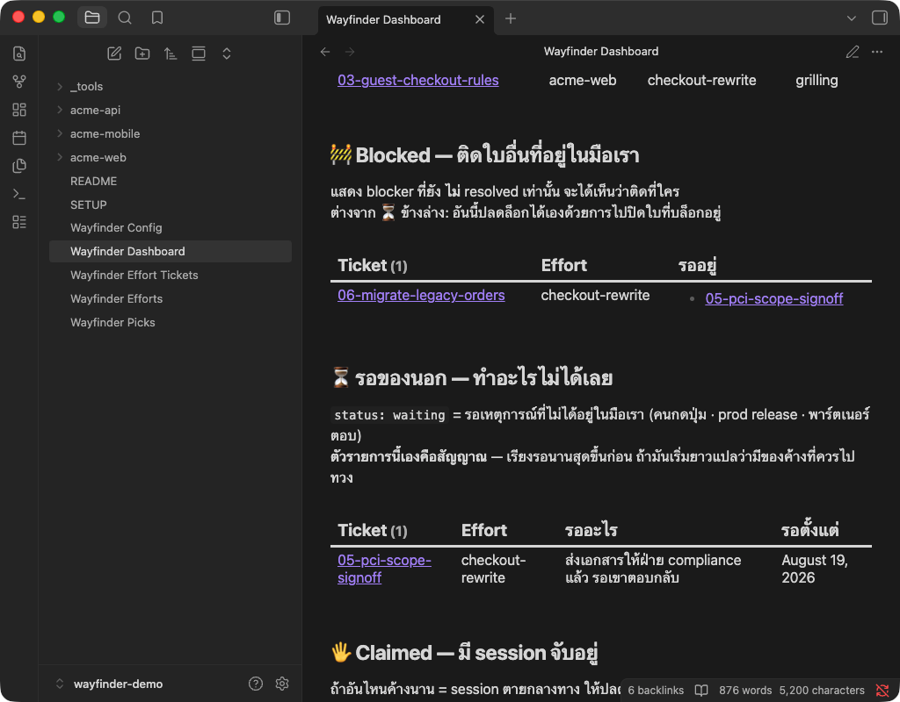
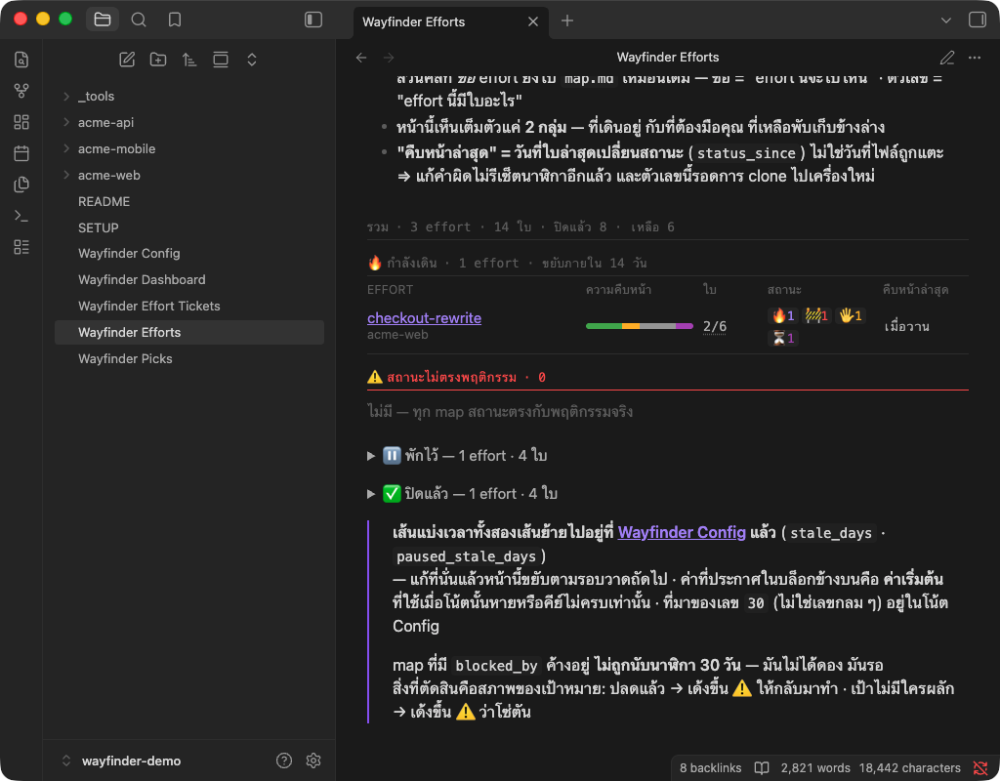

# wayfinder-template

**ภาษาไทย** · [English](README.md)

ตัวติดตั้งของ **wayfinder** — วิธีวางแผนงานก้อนใหญ่ที่ session เดียวเอาไม่อยู่ — พร้อม Obsidian vault
ที่เป็นบ้านของแผนพวกนั้น

## wayfinder คืออะไร

งานบางชิ้นมาถึงในสภาพ "ไอเดียลอย ๆ ที่ยังมองไม่เห็นทาง" — บอกได้ว่าปลายทางคืออะไร แต่บอกไม่ได้ว่าจะไป
ยังไง สกิล `/wayfinder` ชาร์ตเส้นทางนั้นออกมาเป็น **map หนึ่งใบ** กับกอง **ticket** โดยที่หนึ่ง ticket
= **หนึ่งคำถาม** ขนาดพอดีหนึ่ง session แล้วไล่ปิดทีละใบ · ส่วน *Decisions so far* บน map ก็ยาวขึ้น
เรื่อย ๆ จนไม่เหลืออะไรให้ตัดสินใจอีก แล้วค่อยลงมือทำจริง

map เป็น **ดัชนี ไม่ใช่ที่เก็บของ** — คำตอบแต่ละข้ออยู่ใน ticket ของมันที่เดียว map แค่สรุปหนึ่งบรรทัด
แล้วลิงก์ไป · session มาแล้วก็ไป **สิ่งที่อยู่รอดคือ map**

สกิลที่ ship มาด้วยมีสองตัว: `/wayfinder` ชาร์ต map แล้วไล่ปิด ticket · `/wayfinder-next` หยิบใบที่
*หยิบได้ตอนนี้จริง ๆ* มาทำเป็น chip กดครั้งเดียวเปิด session ถัดไป

ส่วน**รูปแบบ**ของ map กับ ticket เอง — frontmatter · สถานะ · blockers · สามหน้า dashboard ที่อ่านมัน —
เขียนไว้ที่เดียวคือ [`template/README.md`](template/README.md) ซึ่งจะถูกติดตั้งเป็น README ของ vault คุณ
**นั่นคือสำเนาเดียวที่มี** หน้านี้จึงตั้งใจไม่เล่าซ้ำ

## หน้าตาเป็นยังไง

สองในสาม dashboard ตอนอ่าน vault ที่มี 3 effort กับ 14 ใบอยู่ข้างใน



**ระดับใบ** — อันไหนหยิบได้เดี๋ยวนี้ · อันไหนติดใบอื่นที่อยู่ในมือเราเองและติดใบไหน · อันไหนรอคนนอก
พร้อมเหตุผลและวันที่เริ่มรอ · ไม่มีอันไหนเป็นสถานะที่ตั้งด้วยมือ — *blocked* ถูกคำนวณจาก `blockers`
ทุกครั้งที่ query รัน ⇒ ปิดใบที่บล็อกเมื่อไหร่ ใบนี้เด้งไป Frontier เอง



**ระดับแมป** — หนึ่งแถวต่อหนึ่ง effort บอกว่าเดินไปถึงไหน ตัวเลขนั้นมาจากใบอะไรบ้าง และขยับล่าสุดเมื่อไหร่
· effort ที่พักไว้กับที่ปิดแล้วถูกพับเก็บไว้ข้างล่าง ไม่มาแย่งที่กับงานที่อยู่ตรงหน้า

## repo นี้คืออะไร และ**ไม่ใช่**อะไร

repo นี้คือ **ตัวติดตั้ง/template** — **ไม่ใช่ vault** และแผนของคุณไม่ได้อยู่ที่นี่

- **vault เป็นของคุณ** installer เขียนมันลงโฟลเดอร์ที่คุณเลือก · มันเป็น git repository ของตัวเอง
  มี history ของตัวเอง และ**ไม่มีอะไรจากมัน push กลับมาที่นี่**
- **repo นี้คือต้นฉบับ** `template/` คือ vault เป๊ะ ๆ อย่างที่ควรอยู่บนดิสก์ ⇒ **อย่าแก้ไฟล์ที่เป็นของ
  `template/` ใน vault ตัวเอง** เพราะการอัปเดตครั้งหน้าทับ `template/` ทั้งชุด แล้วสิ่งที่คุณแก้จะหาย
  ไปเงียบ ๆ · อยากแก้ให้ส่ง pull request มาที่นี่ — repo นี้เป็นของต้นฉบับ ไม่ใช่ของที่ build ออกมาจาก
  vault ของใคร
- **งานของคุณไม่ถูกแตะ** effort ของคุณ (โฟลเดอร์ `<repo>/<effort>/` ที่เก็บ map กับ ticket) เป็นของคุณ
  ตัวอัปเดตไม่มีเส้นทางไหนไปถึงมันเลย

## ทำไม map ถึงต้องอยู่นอก repo ของงานที่มันวางแผนให้

เพราะแผนที่เก็บไว้ใน repo ของงานเองมีสองทางที่จะตาย และมันเกิดมาแล้วทั้งสองทาง:

1. **ตายไปพร้อม branch** map ที่เขียนลง `docs/plan/` ของ repo งาน มีชีวิตอยู่ใน worktree เดียว ·
   ลบ worktree ทิ้ง (ซึ่งเป็นการเก็บกวาดตามปกติ) map ก็หายไปด้วย ยังไม่ได้ commit เอาคืนไม่ได้ ·
   **เคยหายมาแล้วทั้งใบ** — และความสูญเสียครั้งนั้นคือเหตุผลที่ vault นี้เกิดขึ้น
2. **ต่อให้ไม่ลบ ก็ commit ไม่ได้อยู่ดี** แผนคือของใช้ครั้งเดียว — ขับงานชิ้นเดียวจบแล้วแทบไม่ได้กลับมา
   อ่านอีก · commit เข้าไปเมื่อไหร่มันก็ติดไปกับ pull request แล้วฝังอยู่ใน history ของ repo นั้นตลอดไป

vault เดียว อยู่นอก repo งานทุกตัว มี git ของตัวเอง ปิดรูทั้งสองพร้อมกัน — map อยู่ได้นานกว่า branch
ที่มันถูกเขียนขึ้นมา และไม่มี repo งานไหนต้องแบกมันไว้

## ติดตั้งยังไง

คำสั่งเดียว ไม่ต้อง clone อะไรเลย:

```bash
npx https://github.com/metasP/wayfinder-template
```

มันถามคำถาม 5 ข้อชุดเดียวกับที่ agent จะถาม ทีละข้อ และ **ไม่เขียนอะไรจนกว่าจะตอบครบทุกข้อ**
ไม่มีอะไรถูกติดตั้งค้างไว้ในเครื่อง — npx รันจาก cache ครั้งเดียวแล้วทิ้งสำเนานั้นไป

หรือจะ clone มาอ่านก่อนแล้วค่อยให้ agent ติดตั้งให้ก็ได้:

```bash
git clone https://github.com/metasP/wayfinder-template ~/Documents/Git/wayfinder-template
cd ~/Documents/Git/wayfinder-template
```

จากนั้นเปิด agent ในโฟลเดอร์นั้นแล้วบอกว่า *"ติดตั้ง wayfinder จาก repo นี้"* · มันจะตรวจเครื่องคุณก่อน
รายงานว่าเจออะไร แล้ว **ถามก่อนแตะทุกอย่างที่อยู่นอก vault** — จะวาง vault ไว้ไหน วางสกิลไว้ไหน
และจะให้มันเขียนอะไรได้อีกบ้าง

รายละเอียดทั้งหมด รวมถึงว่ามันจะถามอะไรและควรตอบยังไง อยู่ที่ **[`INSTALL.th.md`](INSTALL.th.md)**
(ฉบับอังกฤษ: [`INSTALL.md`](INSTALL.md))

> **มีคำถามข้อหนึ่งที่สำคัญกว่าข้ออื่นทั้งหมด** — installer จะเติมย่อหน้า wayfinder ลงใน
> `~/.claude/CLAUDE.md` · **ย่อหน้านั้นเป็นที่เดียวที่บอก `/wayfinder` ว่า vault ของคุณอยู่ไหน**
> ถ้าไม่ให้เติม สกิลจะไปทำตามกติกา issue tracker ของ repo ที่คุณบังเอิญเปิดอยู่แทน — map จะไปลงที่อื่น
> **โดยไม่มีอะไรเตือนเลยสักอย่าง**

## อัปเดตยังไง

```bash
npx https://github.com/metasP/wayfinder-template
```

**คำสั่งเดียวกับตอนติดตั้งเป๊ะ** · จะได้อันไหนเป็นการตัดสินของ *vault* ไม่ใช่ของคุณ — vault ที่มี manifest
อยู่แล้วจะเข้าโหมด update และ **ไม่ถามอะไรเลย** เพราะคำตอบตอนติดตั้งถูกจดไว้แล้ว · เติม `--plan`
ถ้าอยากเห็นก่อนว่ามันจะทำอะไรบ้าง

หรือถ้ามี clone ไว้ในเครื่อง จะ pull แล้วบอก agent ว่า *"update wayfinder"* ก็ได้ผลเหมือนกัน:

```bash
cd ~/Documents/Git/wayfinder-template
git pull
```

- `template/` ถูกทับ **ทั้งชุด all-or-nothing** — โน้ตใน vault เช็คค่าคงที่ข้ามไฟล์กันเอง
  อัปเดตครึ่ง ๆ กลาง ๆ = vault พัง
- **effort ของคุณไม่ถูกแตะ**
- **ค่าที่คุณจูนไว้ไม่หาย** `Wayfinder Config.md` (เส้นแบ่งเวลา · สี Graph View · ป้ายสถานะ) กับ
  `Wayfinder Picks.md` (กฎ "หยิบอันไหนต่อ" ที่คุณเขียนเอง) ถูกวางครั้งเดียวตอนติดตั้ง แล้วไม่แตะอีกเลย

ตัวอัปเดตทำงานจาก manifest ที่จดไว้ตอนติดตั้ง ⇒ มันทับหรือลบได้เฉพาะไฟล์ที่ตัวมันเองเป็นคนวาง ·
ของอื่นที่คุณเก็บไว้ใน vault มันมองไม่เห็นเลย

## ต้องมีอะไรบ้าง

- **macOS** และ **Node 18 ขึ้นไป** (`node -v`) — installer เป็นสคริปต์ Node ใบเดียว
- **[Obsidian](https://obsidian.md)** — คนอ่าน vault · สามหน้า dashboard คือโน้ตของ Obsidian
- **[Claude Code](https://claude.com/claude-code)** — คนรันสกิล wayfinder

Dataview ship มาในตัว vault อยู่แล้ว (ดูหัวข้อ [License](#license)) ⇒ ไม่ต้องไปโหลดจาก plugin browser
ของ Obsidian และไม่ต้องรีสตาร์ตกลางคัน

## มีอะไรอยู่ในนี้

| path | คืออะไร |
|---|---|
| [`template/`](template) | ตัว vault เป๊ะ ๆ อย่างที่ควรอยู่บนดิสก์ · ถูกทับทั้งชุดทุกครั้งที่อัปเดต |
| [`template/README.md`](template/README.md) | คู่มือรูปแบบ map/ticket (ไทย) · จะกลายเป็น README ของ vault คุณ |
| [`template/SETUP.md`](template/SETUP.md) | อัปเดตและตรวจสุขภาพ vault ที่ติดตั้งไปแล้ว |
| [`template/_tools/`](template/_tools) | `bootstrap.mjs` (ติดตั้ง/อัปเดต) · `doctor.mjs` (ตรวจสุขภาพ + ลินต์ ticket ทุกใบ) · `autocommit.sh` (commit vault ให้เองทุกครั้งที่ agent แก้ ticket) |
| [`template/example-repo/`](template/example-repo) | effort ตัวอย่างที่ใช้งานได้จริง วางให้ **ตอนติดตั้งเท่านั้น** เพื่อให้ dashboard มีของให้ดูตั้งแต่วันแรก · อ่านจบแล้วลบทิ้งได้ อัปเดตไม่ปลุกมันคืนมา |
| [`skills/`](skills) | สกิล `/wayfinder` และ `/wayfinder-next` (อังกฤษ) · วางไว้ตรงที่คุณบอก installer · `/wayfinder` ดัดแปลงมาจาก [ชุดสกิลของ Matt Pocock](https://github.com/mattpocock/skills) — ดู [`THIRD-PARTY.md`](THIRD-PARTY.md) |
| [`INSTALL.th.md`](INSTALL.th.md) | วิธีติดตั้งและอัปเดตแบบเต็ม (อังกฤษ: [`INSTALL.md`](INSTALL.md)) |
| [`THIRD-PARTY.md`](THIRD-PARTY.md) | ของภายนอกชิ้นเดียวที่ ship ไปด้วย กับ license ของมัน |
| [`LICENSE`](LICENSE) | MIT |

## License

MIT — ดู [`LICENSE`](LICENSE)

มีสองชิ้นใน repo นี้ที่ไม่ได้เขียนขึ้นที่นี่ และเป็น MIT ทั้งคู่:

- **สกิล `/wayfinder`** ดัดแปลงมาจากสกิล `wayfinder` ใน
  **[ชุดสกิลของ Matt Pocock](https://github.com/mattpocock/skills)** — เนื้อส่วนใหญ่ยังเป็นของเขา · ความคิดที่ repo ทั้งใบนี้
  สร้างขึ้นรอบ ๆ มันเป็นของเขา สิ่งที่เพิ่มเข้ามาที่นี่คือ *ที่อยู่* ให้ map ไปลง
- **Dataview 0.5.68** ของ Michael Brenan (`blacksmithgu`) ship มาใน `template/.obsidian/`
  เพื่อให้ vault ที่เพิ่งติดตั้งสด ๆ **ครบอยู่บนดิสก์ก่อน** ที่ Obsidian จะเปิดมันครั้งแรก

รายละเอียด สิ่งที่ถูกแก้ และตัวบท license เต็มอยู่ที่ [`THIRD-PARTY.md`](THIRD-PARTY.md)
